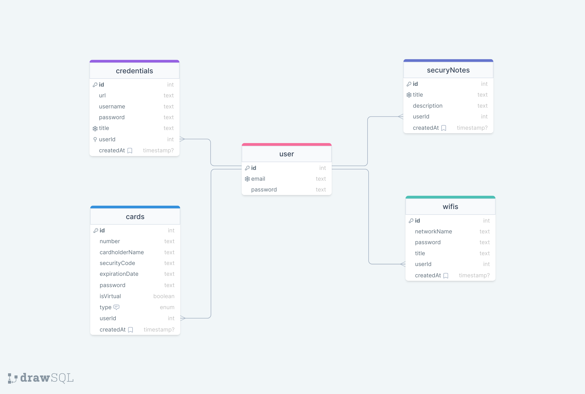

  

<h1 align="center">DrivenPass API</h1>
<h2 align="center">Built with</h2>

  
  
    
  
  

## General Info

DrivenPass API is a password manager

## Table of Contents

- [DataBase](#database)

## Database

